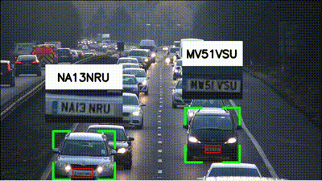

# Vehicle License Plate Detection and Tracking Project

## Overview

This project is designed to detect, track, and read the license plates of vehicles in a video. It leverages deep learning models for object detection and OCR (Optical Character Recognition) to extract license plate numbers and associate them with the corresponding vehicles across video frames.



## Project Structure

The project consists of three main folders:

1. **main**: Contains the main code files that perform detection, tracking, and visualization of results.
2. **test**: Contains sample test data for validating the functionality of the project.
3. **train**: Contains data and scripts (if any) for training the models used in the project.

## Folder Structure

```
.
├── main
│   ├── main.py
│   ├── visualize.py
│   ├── add_missing_data.py
│   ├── yolov8n.pt
│   ├── license_plate_detector.pt
│   └── test.csv
│
├── test
│   ├── realtime test.ipynb
│   └── setup.py
│
├── train
│   ├── contours.ipynb
│   ├── yolov3.ipynb
│   └── contour + yolov3.ipynb
│
└── README.md
```

### `main` Folder

- **main.py**: The primary script for processing the video. It performs vehicle detection, license plate detection, and OCR. The detected and tracked data is saved in a CSV file.
  
- **visualize.py**: This script reads the processed data from a CSV file and visualizes the results by drawing bounding boxes around vehicles and license plates on the video frames. The annotated video is saved as `out.mp4`.

- **add_missing_data.py**: This script interpolates missing data for frames where the vehicles or license plates might not have been detected. It ensures that the tracking data is continuous for each vehicle.

- **sample.mp4**: A sample video used for testing the detection and tracking pipeline.

- **yolov8n.pt**: The pre-trained YOLOv8 model used for vehicle detection.

- **license_plate_detector.pt**: The pre-trained model for detecting license plates.

- **test.csv**: The CSV file generated by `main.py`, containing detected vehicles and license plates data.

## Instructions

### Running the Project

1. **Setup**: Ensure all necessary dependencies are installed. You might need `opencv-python`, `ultralytics`, `pandas`, `numpy`, and `scipy` installed in your Python environment.

2. **Processing Video**:
   - Run the `main.py` script to process the input video (`sample.mp4`). This will generate a `test.csv` file containing the detected vehicle and license plate information.

   ```
   python main.py
   ```

3. **Interpolating Missing Data**:
   - To fill in any gaps in detection data, run `add_missing_data.py` to generate an interpolated CSV file `test_interpolated.csv`.

   ```
   python add_missing_data.py
   ```

4. **Visualizing Results**:
   - Run `visualize.py` to create an output video (`out.mp4`) that visualizes the tracked vehicles and their license plates.

   ```
   python visualize.py
   ```

## Conclusion

This project showcases a complete pipeline for vehicle detection, tracking, and license plate recognition. The modular design allows easy customization and extension, such as integrating new detection models or improving the interpolation algorithm for missing data.